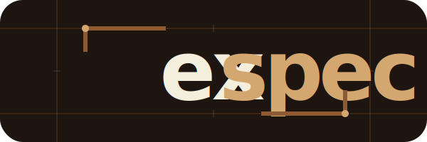

# EXSPECSO

**Spec-driven framework for balanced software delivery.**

Exspecso is a spec-driven framework that keeps delivery simple without losing context.
The first release will focus on three stages: ideation, planning, and execution.

## Status

- Work in progress on the first release.
- Defining the ideation workflow.
- Defining the planning workflow.
- Defining the execution workflow.
